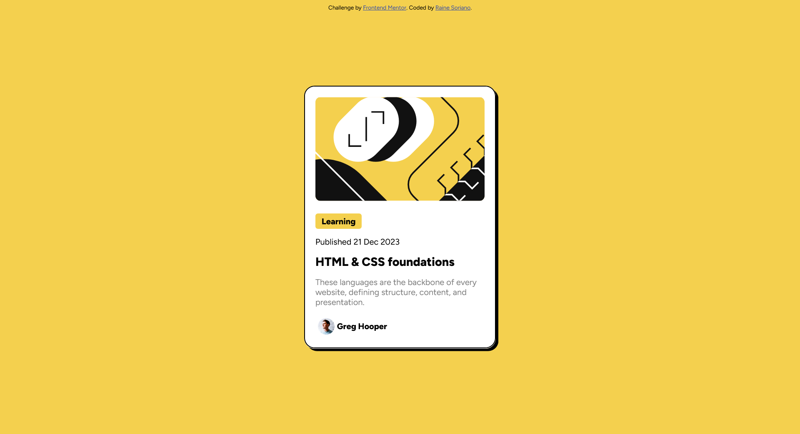

# Blog preview card 

This is a solution to the [Blog preview card challenge on Frontend Mentor](https://www.frontendmentor.io/challenges/blog-preview-card-ckPaj01IcS). Frontend Mentor challenges help you improve your coding skills by building realistic projects. 

## Table of contents

- [Overview](#overview)
  - [The challenge](#the-challenge)
  - [Screenshot](#screenshot)
  - [Links](#links)
- [My process](#my-process)
  - [Built with](#built-with)
  - [What I learned](#what-i-learned)
  - [Useful resources](#useful-resources)
- [Author](#author)

**Note: Delete this note and update the table of contents based on what sections you keep.**

## Overview

### The challenge

Users should be able to:

- See hover and focus states for all interactive elements on the page

### Screenshot



### Links

- Solution URL: [Add solution URL here](https://your-solution-url.com)
- Live Site URL: [Add live site URL here](https://your-live-site-url.com)

## My process

### Built with

- Semantic HTML5 markup
- CSS custom properties
- Flexbox

### What I learned

Learned how to create hover effects. When you hover over the card, the box shadow grows and the article title changes color:

```css
.card:hover {
    box-shadow: 10px 10px;
}

.card:hover h1 {
    color: hsl(47, 88%, 63%);
}
```

Learned how to target the correct elements in my stylesheet. To access an img contained within the .author class contained within the .card class:

```css
.card .author img {
    /*style here!*/
}
```

To style in img of class .illustration contained within the .card class, noting the difference in spacing:

```css
.card img.illustration {
    /*style here!*/
}
```

### Useful resources

- [11 ways to center a div or text in a div](https://blog.hubspot.com/website/center-div-css#center-text-vertically) - I referred to this blogpost multiple times to figure out centering, and I will probably continue to refer to it.
- [W3Schools](https://www.w3schools.com/css) - W3Schools has always been my goto resource for quickly picking up new languages. CSS is no exception.

## Author

- Website - [Raine Soriano](https://github.com/rainearcher)
- Frontend Mentor - [@rainearcher](https://www.frontendmentor.io/profile/rainearcher)
